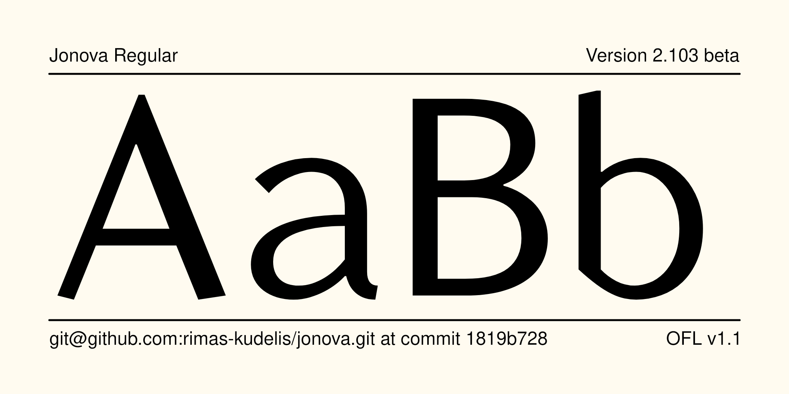
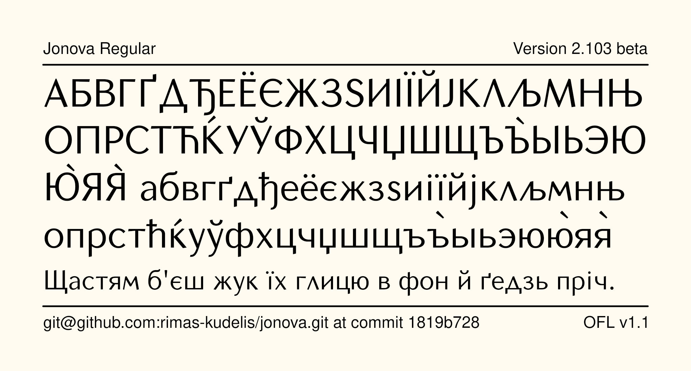
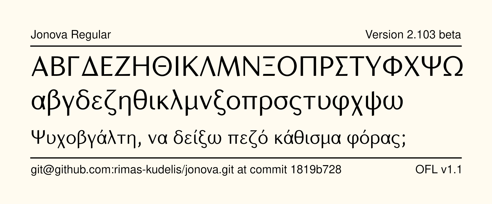

# Jonova

[![][Fontbakery]](https://rimas-kudelis.github.io/jonova/fontbakery/fontbakery-report.html)
[![][Universal]](https://rimas-kudelis.github.io/jonova/fontbakery/fontbakery-report.html)
[![][GF Profile]](https://rimas-kudelis.github.io/jonova/fontbakery/fontbakery-report.html)
[![][Shaping]](https://rimas-kudelis.github.io/jonova/fontbakery/fontbakery-report.html)

[Fontbakery]: https://img.shields.io/endpoint?url=https%3A%2F%2Fraw.githubusercontent.com%2Frimas-kudelis%2Fjonova%2Fgh-pages%2Fbadges%2Foverall.json
[GF Profile]: https://img.shields.io/endpoint?url=https%3A%2F%2Fraw.githubusercontent.com%2Frimas-kudelis%2Fjonova%2Fgh-pages%2Fbadges%2Frimas-kudelis.json
[Outline Correctness]: https://img.shields.io/endpoint?url=https%3A%2F%2Fraw.githubusercontent.com%2Frimas-kudelis%2Fjonova%2Fgh-pages%2Fbadges%2FOutlineCorrectnessChecks.json
[Shaping]: https://img.shields.io/endpoint?url=https%3A%2F%2Fraw.githubusercontent.com%2Frimas-kudelis%2Fjonova%2Fgh-pages%2Fbadges%2FShapingChecks.json
[Universal]: https://img.shields.io/endpoint?url=https%3A%2F%2Fraw.githubusercontent.com%2Frimas-kudelis%2Fjonova%2Fgh-pages%2Fbadges%2FUniversal.json

Jonova is a contemporary sans-serif font especially suitable for Lithuanian text with stressed letters having acute, grave or tilde accent marks. Many other phonetic marks, special Lithuanian ideograms and heraldic symbols are also provided. Special care has been taken to enhance the quality of letterforms when displayed on the computer screen, ensuring that Jonova is highly legible at small sizes whether displayed on the screen or in print. The characters were hand-instructed by leading hinting expert Jonas Vaičiulis. This typeface is ideal for use in extended text settings such as books, dictionaries, periodicals and office documents.

Jonova started out as a commercial product at [Fotonija]([https://www.fotonija.lt]) in around 2005, but has been open-sourced in 2024 with their permission.

## Samples

## Building

Fonts are built automatically by GitHub Actions - take a look in the "Actions" tab for the latest build.

If you want to build fonts manually on your own computer:

* `make build` will produce font files.
* `make test` will run [FontBakery](https://github.com/rimas-kudelis/fontbakery)'s quality assurance tests.
* `make proof` will generate HTML proof files.

The proof files and QA tests are also available automatically via GitHub Actions - look at `https://yourname.github.io/your-font-repository-name`.

## License

This Font Software is licensed under the SIL Open Font License, Version 1.1.
This license is available with a FAQ at
https://scripts.sil.org/OFL

## Repository Layout

This font repository structure is inspired by [Unified Font Repository v0.3](https://github.com/unified-font-repository/Unified-Font-Repository), modified for the Google Fonts workflow.
